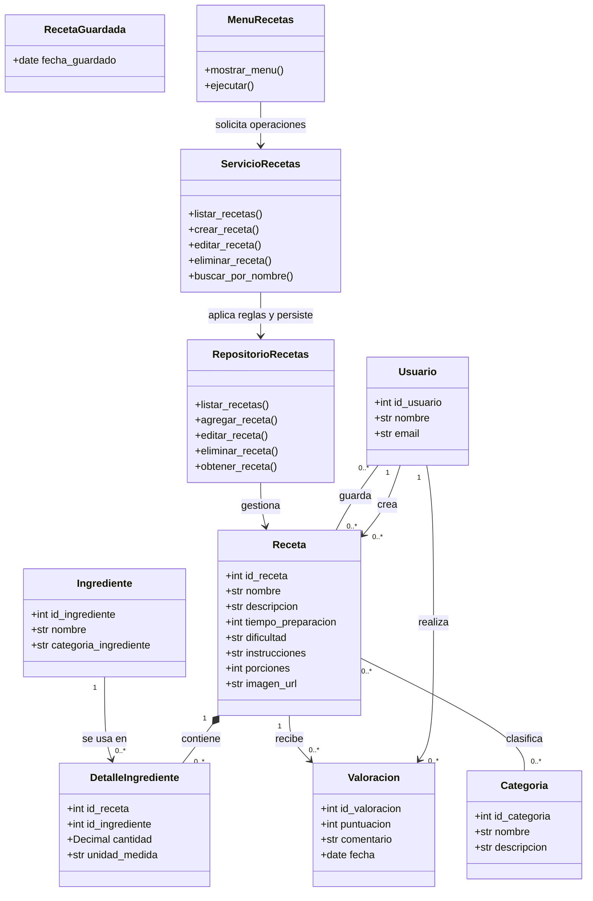

# Diagrama UML de clases

El diagrama resume las entidades del dominio y su relación con las capas de
datos, negocio y presentación.

```mermaid
classDiagram
    class Usuario {
        +int id_usuario
        +str nombre
        +str email
    }
    class Receta {
        +int id_receta
        +str nombre
        +str descripcion
        +int tiempo_preparacion
        +str dificultad
        +str instrucciones
        +int porciones
        +str imagen_url
    }
    class Categoria {
        +int id_categoria
        +str nombre
        +str descripcion
    }
    class Ingrediente {
        +int id_ingrediente
        +str nombre
        +str categoria_ingrediente
    }
    class DetalleIngrediente {
        +int id_receta
        +int id_ingrediente
        +Decimal cantidad
        +str unidad_medida
    }
    class Valoracion {
        +int id_valoracion
        +int puntuacion
        +str comentario
        +date fecha
    }
    class RecetaGuardada {
        +date fecha_guardado
    }
    class ServicioRecetas {
        +listar_recetas()
        +crear_receta()
        +editar_receta()
        +eliminar_receta()
        +buscar_por_nombre()
    }
    class RepositorioRecetas {
        +listar_recetas()
        +agregar_receta()
        +editar_receta()
        +eliminar_receta()
        +obtener_receta()
    }
    class MenuRecetas {
        +mostrar_menu()
        +ejecutar()
    }

    Usuario "1" --> "0..*" Receta : crea
    Receta "1" *-- "0..*" DetalleIngrediente : contiene
    Ingrediente "1" --> "0..*" DetalleIngrediente : se usa en
    Receta "0..*" -- "0..*" Categoria : clasifica
    Usuario "1" --> "0..*" Valoracion : realiza
    Receta "1" --> "0..*" Valoracion : recibe
    Usuario "0..*" -- "0..*" Receta : guarda

    MenuRecetas --> ServicioRecetas : solicita operaciones
    ServicioRecetas --> RepositorioRecetas : aplica reglas y persiste
    RepositorioRecetas --> Receta : gestiona
```
